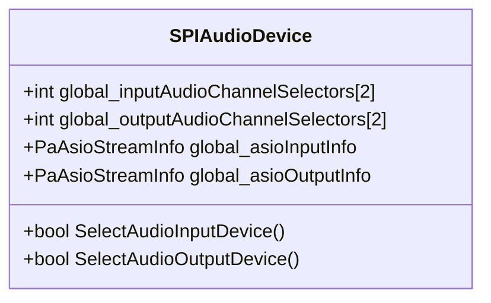

# Configuration Details and Tuning – ASIO Channel Selectors

When compiled with ASIO support on Windows, `SPIAudioDevice` leverages PortAudio’s `PaAsioStreamInfo` structures to specify exactly which ASIO channels should be opened for input or output. This mechanism enables **fine-grained control** over physical channel selection beyond the default stereo pair.

## 🔍 Purpose

This feature exists to:

- Allow users to **map logical audio channels** to arbitrary physical ASIO channels.
- Enable multi-channel ASIO interfaces to be used selectively (e.g. channels 3 & 4 only).
- Avoid opening unused channels, which can reduce latency and resource usage.

## Data Structures

| Symbol | Type | Description |
| --- | --- | --- |
| **global_inputAudioChannelSelectors** | `int[2]` | Requested ASIO input channel indices. |
| **global_outputAudioChannelSelectors** | `int[2]` | Requested ASIO output channel indices. |
| **global_asioInputInfo** | `PaAsioStreamInfo` | ASIO stream info for input. |
| **global_asioOutputInfo** | `PaAsioStreamInfo` | ASIO stream info for output. |


Declarations live in `spiaudiodevice.h`:

```cpp
int global_inputAudioChannelSelectors[2];
int global_outputAudioChannelSelectors[2];
#if PA_USE_ASIO
PaAsioStreamInfo global_asioInputInfo;
PaAsioStreamInfo global_asioOutputInfo;
#endif
```

## ⚙️ Initialization and Configuration

Inside `SelectAudioInputDevice()` and `SelectAudioOutputDevice()`, the ASIO structures are populated before opening the stream:

```cpp
// Common ASIO setup (input shown)
global_asioInputInfo.size            = sizeof(PaAsioStreamInfo);
global_asioInputInfo.hostApiType     = paASIO;
global_asioInputInfo.version         = 1;
global_asioInputInfo.flags           = paAsioUseChannelSelectors;
global_asioInputInfo.channelSelectors= global_inputAudioChannelSelectors;

if(deviceid != Pa_GetDefaultInputDevice()) {
    global_inputParameters.hostApiSpecificStreamInfo = &global_asioInputInfo;
} else {
    global_inputParameters.hostApiSpecificStreamInfo = NULL;
}
```

**Key fields** of `PaAsioStreamInfo`:

- `size` must equal `sizeof(PaAsioStreamInfo)`.
- `hostApiType` set to `paASIO`.
- `flags` uses `paAsioUseChannelSelectors`.
- `channelSelectors` points to a two-element array of channel indices.

## 🔧 Tuning Channel Selectors

Before selecting a device or opening a stream, you can assign **any valid ASIO channel index** to the selector arrays. Use `-1` to disable a channel slot.

```cpp
// Example: Route physical ASIO channels 2 (left) and 3 (right) for input
global_inputAudioChannelSelectors[0] = 2;   // Left
global_inputAudioChannelSelectors[1] = 3;   // Right

// Example: Route only channel 0 for output, disable second slot
global_outputAudioChannelSelectors[0] = 0;
global_outputAudioChannelSelectors[1] = -1;
```

**Tips:**

- **Zero-based indices** correspond to the order exposed by your ASIO driver.
- Setting both selectors to the same index duplicates the channel.
- Use `-1` to ignore the second channel in mono setups.

## ▶️ Example Usage

```cpp
#include "spiaudiodevice.h"

// 1. Choose ASIO channels 4 & 5 for recording
global_inputAudioChannelSelectors[0] = 4;
global_inputAudioChannelSelectors[1] = 5;

// 2. Choose ASIO channels 0 & 1 for playback
global_outputAudioChannelSelectors[0] = 0;
global_outputAudioChannelSelectors[1] = 1;

// 3. Open and start the stream
SPIAudioDevice dev;
if(!dev.SelectAudioInputDevice() || !dev.SelectAudioOutputDevice()) {
    std::cerr << "Failed to configure ASIO device\n";
    return -1;
}
// ... proceed to Pa_OpenStream using global_inputParameters / global_outputParameters
```

## 📈 Class Overview



## ⚠️ Platform & Build Requirements

- Only available on Windows with `**PA_USE_ASIO=1**`.
- Ensure Visual Studio project defines `PA_USE_ASIO` in **PreprocessorDefinitions**.
- Bundled PortAudio tree must include `pa_asio.h`.

By tuning these selectors, you can tailor the utility to your specific ASIO hardware, opening only the channels you need and optimizing performance.