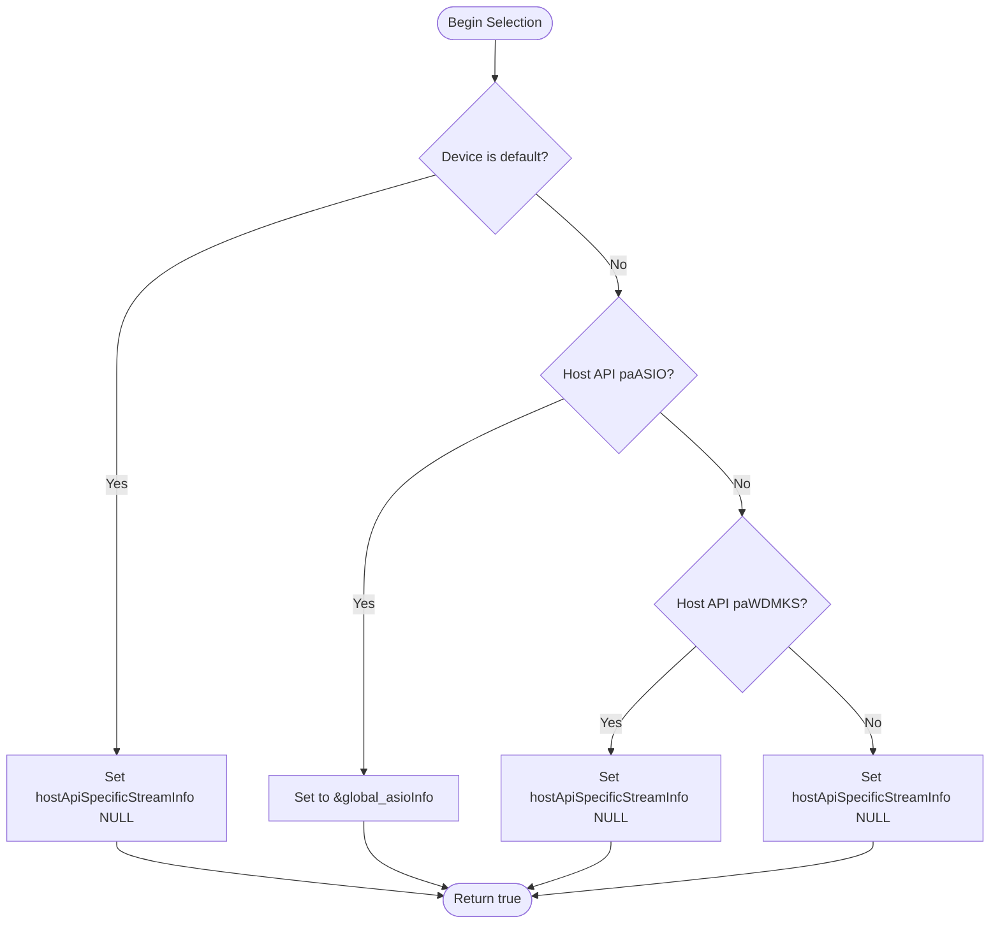

# Configuration Details and Tuning – Host API-Specific Behavior

This section explains how the library configures the `hostApiSpecificStreamInfo` pointer in `PaStreamParameters` for different PortAudio host APIs. Special handling ensures optimal defaults for standard devices while providing advanced options for ASIO. All logic is encapsulated within the `SelectAudioInputDevice` and `SelectAudioOutputDevice` methods, so end users need only specify device names (and optional host API prefixes).

## Default Device Handling

For any device returned by

```cpp
Pa_GetDefaultInputDevice()
```

or

```cpp
Pa_GetDefaultOutputDevice()
```

the library leaves `hostApiSpecificStreamInfo` as **NULL**. This delegates all configuration to PortAudio’s built-in defaults, ensuring standard latency and channel settings without additional overhead.

```cpp
if (deviceid == Pa_GetDefaultInputDevice()) {
    global_inputParameters.hostApiSpecificStreamInfo = NULL;
}
```

```cpp
if (deviceid == Pa_GetDefaultOutputDevice()) {
    global_outputParameters.hostApiSpecificStreamInfo = NULL;
}
```

## ASIO Devices 🎛️

When a device’s host API is **paASIO**, the library prepares a `PaAsioStreamInfo` structure to enable channel selectors. This allows fine-grained control over which ASIO channels are exposed to the application.

```cpp
// Prepare ASIO info (input example)
global_asioInputInfo.size            = sizeof(PaAsioStreamInfo);
global_asioInputInfo.hostApiType     = paASIO;
global_asioInputInfo.version         = 1;
global_asioInputInfo.flags           = paAsioUseChannelSelectors;
global_asioInputInfo.channelSelectors = global_inputAudioChannelSelectors;
```

Within the selection logic:

```cpp
else if (Pa_GetHostApiInfo(Pa_GetDeviceInfo(deviceid)->hostApi)->type == paASIO) {
    global_inputParameters.hostApiSpecificStreamInfo = &global_asioInputInfo;
}
```

Similarly for output:

```cpp
else if (Pa_GetHostApiInfo(Pa_GetDeviceInfo(deviceid)->hostApi)->type == paASIO) {
    global_outputParameters.hostApiSpecificStreamInfo = &global_asioOutputInfo;
}
```

## WDM-KS Devices ⚙️

For **paWDMKS** devices (Windows Kernel Streaming), the library explicitly sets `hostApiSpecificStreamInfo` to **NULL**. All WDM-KS configuration then relies on PortAudio’s internal defaults.

```cpp
else if (Pa_GetHostApiInfo(Pa_GetDeviceInfo(deviceid)->hostApi)->type == paWDMKS) {
    global_inputParameters.hostApiSpecificStreamInfo = NULL;
}
```

And for output:

```cpp
else if (Pa_GetHostApiInfo(Pa_GetDeviceInfo(deviceid)->hostApi)->type == paWDMKS) {
    global_outputParameters.hostApiSpecificStreamInfo = NULL;
}
```

## Summary Table

| Host API Type | Default Device? | hostApiSpecificStreamInfo |
| --- | --- | --- |
| Any (default dev) | Yes | **NULL** |
| paASIO | No | **&global_asioInputInfo**<br/>&global_asioOutputInfo |
| paWDMKS | No | **NULL** |


## Decision Flow in Device Selection

Below is a simplified flowchart showing how `SelectAudioInputDevice` and `SelectAudioOutputDevice` decide on the `hostApiSpecificStreamInfo` value:



## Usage for End Users

End users simply call the selection methods with desired device names (and optional host API prefixes). The library handles all API-specific configuration internally:

```cpp
SPIAudioDevice audioDevice;

// Select based on name or prefix (e.g., "asio:Realtek ASIO")
if (!audioDevice.SelectAudioInputDevice("My ASIO Device")) {
    fprintf(stderr, "Failed to select input device\n");
}
if (!audioDevice.SelectAudioOutputDevice("My Speakers")) {
    fprintf(stderr, "Failed to select output device\n");
}
```

All special cases—default devices, ASIO, WDM-KS—are automatically handled.