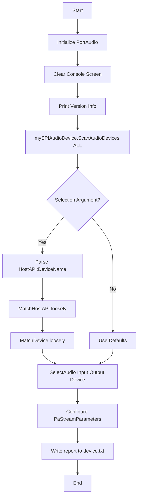

# Getting Started – Overview and Capabilities

This section introduces **spidevicesselect_vs2026**, a Windows-focused console utility and accompanying helper class for discovering, listing, and selecting audio I/O devices via PortAudio. You will learn what the tool and class do, how they work together, and what you can achieve out of the box.

---

## Overview

spidevicesselect_vs2026 consists of two main components:

- `**spidevicesselect**` 🎵

A command-line console tool that:

- Initializes PortAudio
- Enumerates all available audio devices
- Logs a detailed device report to `device.txt`
- Accepts (optional) device selection arguments
- Emits a matching log and final selection

- `**SPIAudioDevice**` ⚙️

A C++ helper class that encapsulates:

- Scanning and grouping PortAudio devices by host API
- Loose or exact matching of device names and host APIs
- Configuration of `PaStreamParameters` for input/output
- Retrieval of device and API names for later use in audio applications

Both components are built as a Visual Studio project against a bundled PortAudio 2021 tree, with ASIO enabled by default. They target multiple Windows host APIs including MME, DirectSound, ASIO, WASAPI, and WDM-KS.

---

## Capabilities

| Feature | Description |
| --- | --- |
| Device Discovery | Scans all PortAudio devices, populates maps for input, output, and host API groupings . |
| Host API Support | Supports MME, DirectSound, ASIO, WASAPI, WDM-KS (and others present via PortAudio) . |
| Loose Matching | Match device or API names by substring (case-insensitive) to accommodate partial names. |
| Default Fallback | Automatically falls back to PortAudio’s default input/output devices when no match is found. |
| Stream Parameter Configuration | Populates `PaStreamParameters` (device ID, channel count, sample format, latency) and, on Windows ASIO, injects `PaAsioStreamInfo` selectors . |
| Detailed Reporting | Emits full device capabilities—latencies, channel counts, ASIO buffer info—to `device.txt` for inspection . |
| Matching Log | Records each matching step (host API found, warnings on ambiguities) to the same log file. |
| Visual Studio Integration | Preconfigured `.vcxproj` targets for Win32/x64 in Debug/Release modes with `PA_USE_ASIO=1` and proper include/lib paths . |


---

## Supported Host APIs

🚀 The tool can discover and group devices across these PortAudio host APIs:

| Host API Identifier | Description |
| --- | --- |
| `paMME` | Windows Multimedia (MME) |
| `paDirectSound` | Microsoft DirectSound |
| `paASIO` | Steinberg ASIO |
| `paWASAPI` | Windows Audio Session API |
| `paWDMKS` | Windows Driver Model KS |


---

## How It Works



- **Initialization**: Calls `Pa_Initialize()` and clears the console.
- **Scanning**: `ScanAudioDevices("", spiaudiodeviceALL)` populates internal maps of all devices and host APIs .
- **Selection**: If an argument is provided (e.g. `ASIO:Realtek ASIO`), it splits on `:` to separate host API and device name, then calls `MatchHostAPI` and `MatchDevice` in “loosely” mode .
- **Configuration**: Selected device IDs feed into `PaStreamParameters` (`device`, `channelCount`, `sampleFormat`, `suggestedLatency`). On ASIO, a `PaAsioStreamInfo` struct is applied .
- **Reporting**: Full device details (channels, latencies, ASIO buffer ranges) get logged to `device.txt`. Subsequent matches and warnings also append to the same file.

---

## Quick Start Example

1. **Build** the Visual Studio solution in Debug or Release for Win32/x64.
2. **Run** without arguments to list all devices and log them:

```bash
   spidevicesselect
```

1. **Run** with a partial device name (e.g. select ASIO “Realtek”):

```bash
   spidevicesselect "ASIO:Realtek"
```

1. **Inspect** the generated `device.txt` for full details and matching traces.

---

> **Note:** - The console output always shows PortAudio version and device count. - If no matching device is found, default PortAudio devices are used.

With this foundation, you can integrate **SPIAudioDevice** into your own audio applications to automate device enumeration and stream setup, leveraging its multi-API, cross-host flexibility.