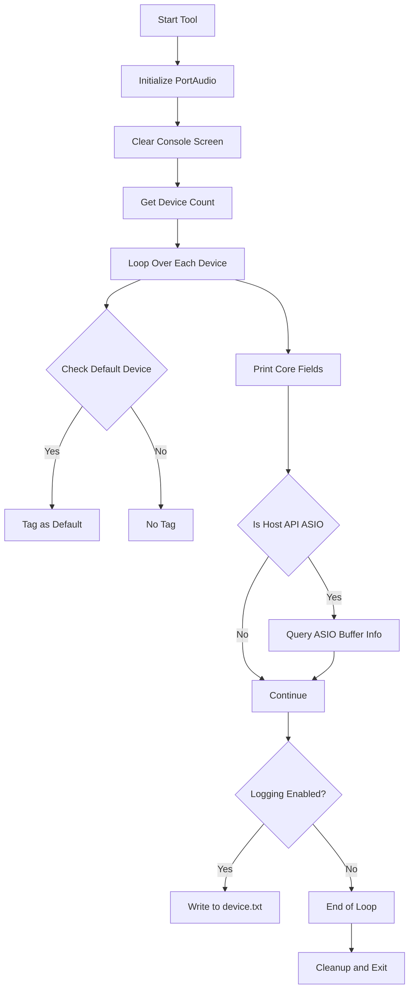

# Running the spidevicesselect Console Tool – Device Listing and Log Output

This section explains how the **spidevicesselect** console utility enumerates audio devices, formats its output, tags default devices, and optionally writes the same information to a log file. It covers:

- Tool invocation and command-line options
- Console output structure and field definitions
- Default device tagging logic
- ASIO-specific buffer and latency information
- Redirecting output to `device.txt` via file logging

---

## Tool Invocation

To launch the utility, simply run the executable. Optionally, you can pass a device name filter as the first argument:

```bash
# List all devices
spidevicesselect_vs2026.exe

# List devices matching "Realtek"
spidevicesselect_vs2026.exe "Realtek"
```

By default, the tool clears the console, prints PortAudio version info, then lists each device in turn.

---

## Console Output Structure 🎛️

Upon startup, the tool calls `Pa_GetDeviceCount`, then iterates over each device index `i` and performs the following steps :

1. **Print header**

```c
   printf( "--------------------------------------- device #%d\n", i );
```

1. **Tag default devices**
2. If `i == Pa_GetDefaultInputDevice()`, tag `[ Default Input ]`.
3. If `i == Pa_GetHostApiInfo(...)->defaultInputDevice`, tag `[ Default <HostAPI> Input ]`.
4. Similarly for output (`Pa_GetDefaultOutputDevice`, host-API default).
5. **Print core fields**

```c
   printf( "Name                        = %s\n", deviceInfo->name );
   printf( "Host API                    = %s\n", Pa_GetHostApiInfo(deviceInfo->hostApi)->name );
   printf( "Max inputs = %d, Max outputs = %d\n", deviceInfo->maxInputChannels, deviceInfo->maxOutputChannels );
   printf( "Default low input latency   = %8.4f\n", deviceInfo->defaultLowInputLatency );
   printf( "Default low output latency  = %8.4f\n", deviceInfo->defaultLowOutputLatency );
   printf( "Default high input latency  = %8.4f\n", deviceInfo->defaultHighInputLatency );
   printf( "Default high output latency = %8.4f\n", deviceInfo->defaultHighOutputLatency );
```

1. **ASIO-specific information** (if present)

```c
   if( Pa_GetHostApiInfo(deviceInfo->hostApi)->type == paASIO ) {
       long minLatency, maxLatency, preferredLatency, granularity;
       err = PaAsio_GetAvailableLatencyValues(i,
             &minLatency, &maxLatency, &preferredLatency, &granularity );
       printf( "ASIO minimum buffer size    = %ld\n", minLatency );
       printf( "ASIO maximum buffer size    = %ld\n", maxLatency );
       printf( "ASIO preferred buffer size  = %ld\n", preferredLatency );
       printf( "ASIO buffer granularity     = %s\n",
               granularity == -1 ? "power of 2" : std::to_string(granularity).c_str() );
   }
```

This extra block queries and prints ASIO buffer constraints .

---

## Field Definitions

| Field | Description |
| --- | --- |
| **Device #** | Zero-based index used by PortAudio |
| **Default Tag** | Marks global or host-API defaults (e.g. `[ Default WASAPI Input ]`) |
| **Name** | Human-readable device name |
| **Host API** | Backend API name (MME, DirectSound, WASAPI, ASIO, etc.) |
| **Max inputs / Max outputs** | Channel capacity |
| **Default low/high input** | Preferred I/O latency under light load |
| **Default low/high output** | Preferred I/O latency for output under light load |
| **ASIO buffer info** | Minimum, maximum, preferred buffer sizes and granularity (ASIO) |


---

## Default Device Tagging Logic

The utility distinguishes between:

- **Global defaults** (PortAudio’s overall default input/output)
- **Host-API defaults** (default for each API)

Tagging is done via a boolean `defaultDisplayed` and checks against:

- `Pa_GetDefaultInputDevice()` / `Pa_GetDefaultOutputDevice()`
- `Pa_GetHostApiInfo(...)->defaultInputDevice` / `defaultOutputDevice`

This ensures each device header is annotated like:

```plaintext
[ Default Input, Default Windows WASAPI Output ]
```

---

## ASIO-Specific Buffer and Latency Info

When compiled with ASIO support, and the device’s Host API is ASIO, the tool calls:

```c
PaAsio_GetAvailableLatencyValues(
    deviceIndex,
    &minLatency,
    &maxLatency,
    &preferredLatency,
    &granularity
);
```

and prints:

- **ASIO minimum buffer size**
- **ASIO maximum buffer size**
- **ASIO preferred buffer size**
- **ASIO buffer granularity**

This helps tune real-time audio settings for professional interfaces .

---

## Redirecting Output to a Log File

To capture the same detailed report in `device.txt`, assign a valid `FILE*` to the `m_pFILE` member **before** scanning :

```cpp
#include "SPIAudioDevice.h"
// ...

// Open log file
std::string devicetxtfilename = "device.txt";
FILE* pFILEdevice = fopen(devicetxtfilename.c_str(), "w");

// Enable file logging
mySPIAudioDevice.m_pFILE = pFILEdevice;

// Proceed with initialization and scanning
Pa_Initialize();
mySPIAudioDevice.ScanAudioDevices();
fclose(pFILEdevice);
```

When `m_pFILE` is non-NULL, the same headers, fields, default tags, and ASIO info are written to the file in parallel with console output .

---

## High-Level Flowchart



This diagram illustrates the **scan → print → (optional ASIO info) → log** workflow.

---

**Key Takeaways**

- The console tool leverages PortAudio to provide a comprehensive device inventory.
- Default devices are clearly marked to assist in selection.
- ASIO interfaces receive specialized buffer and latency data.
- Simple file-logging support lets you persist results for later analysis.