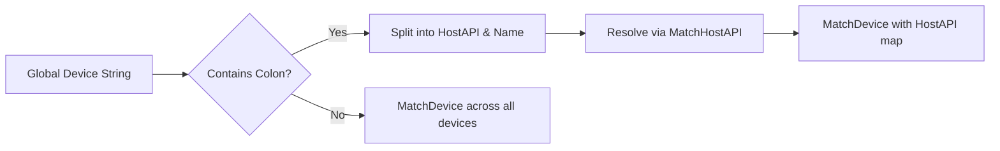

# Selecting Audio Devices with SPIAudioDevice – Match Modes and Host API Prefix Syntax

This section explains how `SPIAudioDevice` interprets and matches audio device names when using the `"loosely"` match mode. It covers the **match modes**, the **host API prefix syntax**, and the **matching flow**, showing how device strings like

`"ASIO:Realtek ASIO"` are resolved to PortAudio device IDs.

---

## ⚙️ Match Modes in `ScanAudioDevices`

`ScanAudioDevices` accepts two parameters:

- `**matchmode**` (`string`): Determines matching strategy.
- `**ioflag**` (`spiaudiodevicetypeflag`): Filters input, output, or both.

| matchmode | Behavior |
| --- | --- |
| `""` | Clear and repopulate all device and host-API maps. |
| `"loosely"` | Interpret a stored device string; support optional host-API prefix and partial matching. |


When `matchmode` is empty, the function rebuilds internal maps. In `"loosely"` mode, it interprets the global device name (and optional prefix) to select a single device ID .

---

## 📌 Host API Prefix Syntax

To explicitly target a host API, prepend its label to the device name using a colon separator:

```plaintext
"<HostAPILabel>:<DeviceName>"
```

- **Prefix** (`<HostAPILabel>`): e.g. `ASIO`, `MME`, `Windows WASAPI`
- **Identifier** (`<DeviceName>`): The actual device name to match.

If no prefix is provided, matching spans all devices of the given I/O flag.

### Supported Host API Labels

| Label | Resolved PortAudio Host API Constant |
| --- | --- |
| ASIO | `paASIO` |
| MME | `paMME` |
| DIRECTSOUND | `paDirectSound` |
| Windows WASAPI / WASAPI | `paWASAPI` |
| WDMKS / Windows WDM-KS | `paWDMKS` |
| JACK / COREAUDIO / ALSA / OSS / AL / BEOS / AUDIOSCIENCEHPI | various |


These entries are initialized in `global_hostapimap_hostapitype` .

---

## Matching Flowchart



---

## Matching Steps

1. **Extract Prefix**

Check for a colon (`":"`) in the global device string.

```cpp
   std::size_t found = global_audiooutputdevicename.find(":");
   if (found != std::string::npos) {
       global_audiooutputhostapi    = global_audiooutputdevicename.substr(0, found);
       global_audiooutputdevicename = global_audiooutputdevicename.substr(found + 1);
       // Log prefix detection…
   }
```

1. **Resolve Host API**

Call `MatchHostAPI("loosely", ioflag)` to map the prefix string to a PortAudio host-API type.

```cpp
   int hostapitype = MatchHostAPI("loosely", spiaudiodeviceOUTPUT);
```

Internally, it performs case-insensitive, partial matching against

`global_hostapimap_hostapitype` .

1. **Match Device Name**

Invoke `MatchDevice("loosely", ioflag, hostapitype)` to search within the chosen host-API map:

```cpp
   int deviceid = MatchDevice("loosely", spiaudiodeviceOUTPUT, hostapitype);
```

- **Case-insensitive**
- **Partial substring** matching
- Returns the first match or `paNoDevice` if none found .

1. **Fallback without Prefix**

If no colon is found, skip host-API resolution:

```cpp
   deviceid = MatchDevice("loosely", spiaudiodeviceOUTPUT);
```

This searches **all** output devices regardless of host API .

---

## Example Usage

```cpp
SPIAudioDevice audioDev;
audioDev.ScanAudioDevices();  // Build device lists

// Select output device "ASIO:Realtek ASIO"
global_audiooutputdevicename = "ASIO:Realtek ASIO";
int devId = audioDev.ScanAudioDevices("loosely", spiaudiodeviceOUTPUT);

if (devId != paNoDevice) {
    // Configure stream with devId…
}
```

---

**Key Takeaways**

- Using `**"loosely"**` enables flexible, user-friendly device selection.
- Prefix syntax `**<HostAPI>:<DeviceName>**` forces matching within a specific API.
- Both host API and device name matching are **partial** and **case-insensitive**.