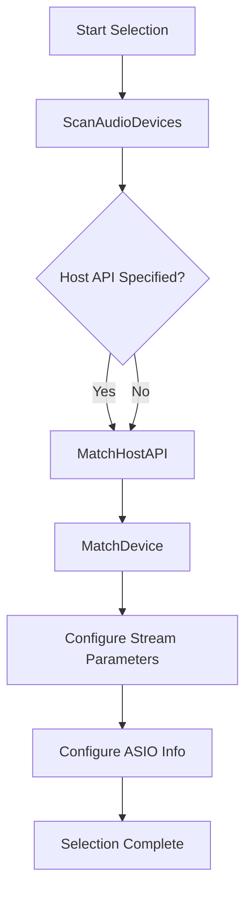
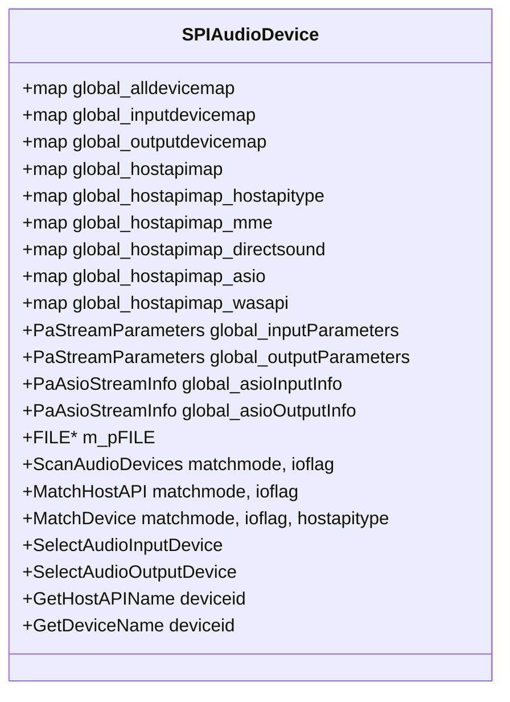

# Selecting Audio Devices with SPIAudioDevice

The `SPIAudioDevice` class centralizes all logic for discovering, naming, grouping, and selecting PortAudio devices. It provides a unified interface to enumerate input/output endpoints, match them by name or host API, configure stream parameters (including ASIO channel selectors), and emit verbose diagnostics to a log file .

### SPIAudioDevice Responsibilities 🚀

- **Scanning**

Enumerates all available PortAudio devices and populates internal maps for

-  devices
-  devices
-  devices
- **Naming & Grouping**

Maintains mappings from device IDs to human-readable names and groups them by host API type (MME, DirectSound, ASIO, WASAPI, WDM-KS, JACK, ALSA, etc.)

- **Matching**

Provides flexible, case-insensitive matching routines:

- `MatchHostAPI` selects the host API by name
- `MatchDevice` finds a device ID based on name and optional host API
- **Selection & Configuration**
- `SelectAudioInputDevice` and `SelectAudioOutputDevice` set up `PaStreamParameters`
- When ASIO is enabled, `PaAsioStreamInfo` structures configure channel selectors
- **Diagnostics**

A `FILE* m_pFILE` member logs detailed reports of each scanning and matching step. Enable it to trace internal decisions and warnings .

### Key Members

| Member | Type | Purpose |
| --- | --- | --- |
| global_alldevicemap | `map<int,string>` | Map of all device IDs → names |
| global_inputdevicemap | `map<int,string>` | Map of input-only device IDs → names |
| global_outputdevicemap | `map<int,string>` | Map of output-only device IDs → names |
| global_hostapimap | `map<int,string>` | Device ID → host API name |
| global_hostapimap_hostapitype | `map<int,string>` | Host API type enum → string (for matching) |
| global_hostapimap_mme, _directsound, _asio, … | `map<int,string>` | Per-API device maps (MME, DirectSound, ASIO, …) |
| global_inputParameters | `PaStreamParameters` | Input stream configuration |
| global_outputParameters | `PaStreamParameters` | Output stream configuration |
| global_asioInputInfo / global_asioOutputInfo | `PaAsioStreamInfo` | ASIO-specific channel selectors (Windows only) |
| m_pFILE | `FILE*` | External log for verbose diagnostics |


### Public Methods

| Method | Description |
| --- | --- |
| `int ScanAudioDevices(string matchmode, spiaudiodevicetypeflag ioflag)` | Populate or filter device maps |
| `int MatchHostAPI(string matchmode, spiaudiodevicetypeflag ioflag)` | Return host API enum matching `global_audio*hostapi` |
| `int MatchDevice(string matchmode, spiaudiodevicetypeflag ioflag, int hostapitype)` | Return device ID matching name and API |
| `bool SelectAudioInputDevice()` | Populate `global_inputParameters` and ASIO info |
| `bool SelectAudioOutputDevice()` | Populate `global_outputParameters` and ASIO info |
| `string GetHostAPIName(int deviceid)` | Retrieve host API name for a device ID |
| `string GetDeviceName(int deviceid)` | Retrieve device name for a device ID |


### Selection Workflow

This flowchart illustrates the device scanning and selection process:



### Example Usage

```cpp
#include "spiaudiodevice.h"
#include <cstdio>

int main() {
    // Open log file for diagnostics
    FILE* logFile = fopen("device_log.txt", "w");

    // Instantiate and initialize
    SPIAudioDevice audioDevice;
    audioDevice.m_pFILE = logFile;

    // Enumerate all devices
    audioDevice.ScanAudioDevices();

    // Select default input/output endpoints
    audioDevice.SelectAudioInputDevice();
    audioDevice.SelectAudioOutputDevice();

    // Access configured parameters
    auto inputParams  = audioDevice.global_inputParameters;
    auto outputParams = audioDevice.global_outputParameters;

    fclose(logFile);
    return 0;
}
```

### Class Structure



```card
{
    "title": "Verbose Logging",
    "content": "Assign a valid FILE* to `m_pFILE` to capture detailed scanning and matching diagnostics."
}
```