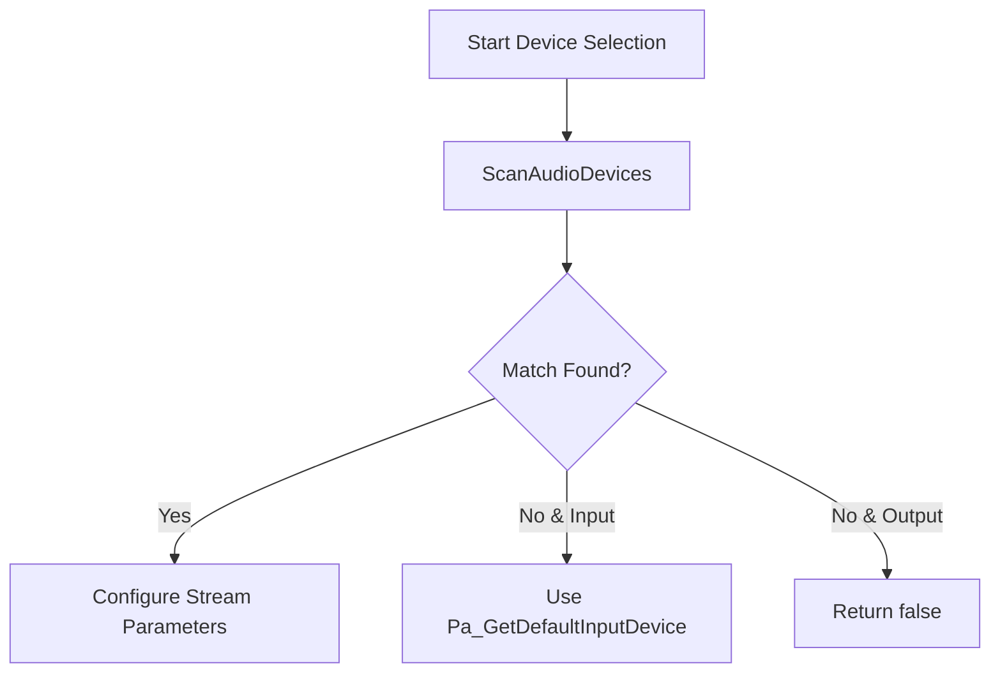

# Troubleshooting and Diagnostics - No Device Found or Selection Fails

When `SelectAudioOutputDevice` returns `false` or an unexpected device is chosen, follow these steps to identify and resolve the issue. This guide covers name verification, host-API disambiguation, scan requirements, log inspection, and fallback behavior.

## Quick Resolution Table 🛠️

| Symptom | Possible Cause | Recommended Action |
| --- | --- | --- |
| `SelectAudioOutputDevice()` returns `false` | No matching device name found | Check spelling & spacing in the device list |
| Unexpected device selected | Multiple devices share a similar name | Prefix with host API (e.g. `ASIO:…`, `WASAPI:…`) |
| No device entry in list | `ScanAudioDevices()` has never been called | Call `ScanAudioDevices()` before selection |
| Warning in `device.txt` | Ambiguous host API or device match | Inspect and resolve warnings in `device.txt` |


## 1. Verify Device Name and Spacing

Ensure the device name you pass exactly matches the listing or `device.txt` log.

```bash
# List available devices and generate device.txt
spidevicesselect.exe "Your Device Name"
notepad device.txt
```

- Open **device.txt** to view each entry’s `devicename` field .
- Copy the **exact** text, including spaces and special characters.

## 2. Disambiguate with Host API Prefix

If several devices share similar names, prepend the host API to the device name:

| Prefix | Meaning |
| --- | --- |
| `ASIO:` | Match against ASIO devices |
| `WASAPI:` | Match against Windows WASAPI devices |
| `MME:` | Match against Windows MME devices |


```cpp
// Example: select Realtek ASIO device
global_audiooutputdevicename = "ASIO:Realtek ASIO";
audio.SelectAudioOutputDevice();
```

This forces the match routines to select from a specific host API .

## 3. Ensure Devices Are Scanned

Before performing a “loose” match, call `ScanAudioDevices()` at least once. The selection helpers do this automatically if their maps are empty, but an explicit call helps populate the maps:

```cpp
SPIAudioDevice audio;
audio.ScanAudioDevices();                 // Populate global maps
bool ok = audio.SelectAudioOutputDevice();
```

- **Input** selection: calls `ScanAudioDevices("loosely", spiaudiodeviceINPUT)` and falls back to default if none found .
- **Output** selection: calls `ScanAudioDevices("loosely", spiaudiodeviceOUTPUT)` and returns `false` on no match .

## 4. Inspect `device.txt` for Warnings

The log file records diagnostic messages via `m_pFILE`. Look for:

- **Missing host API**

```plaintext
  warning: hostapi has NOT been specified
  global_audiooutputhostapi=, global_audiooutputdevicename=MyDevice
```

- **Multiple matching devices**

```plaintext
  warning: more than one matching device found, MyDevice will be ignored.
```

- **Host API match warnings**

```plaintext
  warning: output hostapi not specified.
```

Resolve each warning by adding a prefix, correcting the name, or reducing ambiguity in your device list.

## 5. Understand Fallback Behavior



- **Input**: on no match, falls back to PortAudio’s default input device .
- **Output**: on no match, returns `false` so you can handle the failure explicitly .

## Example Usage

```cpp
SPIAudioDevice audio;
audio.ScanAudioDevices();  // Optional but recommended

// Attempt to select the desired output device
if (!audio.SelectAudioOutputDevice()) {
    std::cerr << "ERROR: Could not select audio output device\n";
    // Consider retry, fallback, or abort
    return -1;
}

// Continue with PortAudio stream setup...
```

**Key Takeaways**

- **Exact matching** is crucial: copy names from the listing.
- **Host API prefixes** resolve collisions.
- **device.txt** is your diagnostic friend: inspect it for hints and warnings.
- **Input** selection gracefully falls back; **output** selection signals failure.