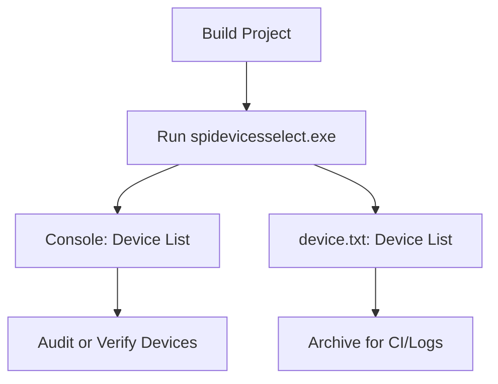

# Typical Usage Scenarios – Listing All Devices on a System

This section shows how to **build**, **run**, and **interpret** the device-listing output of the `spidevicesselect` console utility. You’ll learn how to audit all audio devices on your system, capture a report to a file, and verify new USB or virtual devices.

---

## 1. Building and Running

Compile the Visual Studio solution as usual. Then, from a Developer Command Prompt (or any shell with the executable on your `PATH`), run:

```bash
> spidevicesselect.exe
```

- Running without arguments triggers a **full device scan**.
- The utility initializes PortAudio, clears the screen, and prints version info.
- If you’ve set up `mySPIAudioDevice.m_pFILE` to point at `device.txt`, a copy of the same output is also written there.

```cpp
// Open report file and attach to SPIAudioDevice instance
string devicetxtfilename = "device.txt";
FILE* pFILEdevice = fopen(devicetxtfilename.c_str(), "w");
mySPIAudioDevice.m_pFILE = pFILEdevice;
Pa_Initialize();
system("cls");
printf("PortAudio version number = %d\n", Pa_GetVersion());
// … continue to list devices 
```

---

## 2. Understanding Console Output

When you run `spidevicesselect.exe`, you’ll see:

```plaintext
PortAudio version number = 1902
PortAudio version text   = 'PortAudio V19-devel'
Number of devices        = 53
--------------------------------------- device #0
[ Default Input ] 
Name                        = Microphone (Realtek Audio)
Host API                    = MME
Max inputs = 2, Max outputs = 0
Default low input latency   =   0.0900
Default low output latency  =   0.0900
Default high input latency  =   0.1800
Default high output latency =   0.1800

… repeated for each device …
```

### Field Definitions

| Field | Description |
| --- | --- |
| **device #N** | Sequential index from `0` to `Pa_GetDeviceCount()-1`. |
| **[ Default … ]** | Flags marking system‐wide or host‐API defaults for input/output channels. |
| **Name** | PortAudio’s device name string. |
| **Host API** | The underlying API (e.g. MME, Windows WASAPI, ASIO). |
| **Max inputs / Max outputs** | Maximum simultaneous channels supported. |
| **Default low/high latencies** | Suggested buffer latency (in seconds) for low/high modes. |
| **ASIO buffer info** | For ASIO devices only, prints minimum, maximum, preferred buffer sizes, and granularity. |


---

## 3. Inspecting `device.txt` 📄

If you configured `m_pFILE` to point at a file handle, the exact same information appears in `device.txt`. This is useful when you need a **persistent audit trail**:

```bash
> type device.txt
PortAudio version number = 1902
PortAudio version text   = 'PortAudio V19-devel'
Number of devices        = 53
…
```

- **Enable** by editing `spidevicesselect.cpp`, setting

```cpp
  mySPIAudioDevice.m_pFILE = fopen("device.txt","w");
```

- **Close** the file automatically on program exit (handled by OS).

---

## 4. Common Audit & Verification Use Cases 🔍

- **Device Visibility**

Verify that newly plugged USB microphones, speakers, or virtual cables appear in the list.

- **Latency Comparison**

Compare low/high latency numbers across APIs (MME vs WASAPI vs ASIO).

- **Default Routing**

Confirm which device the system or a given host API considers “default” for input/output.

- **Automated Reporting**

Integrate the `device.txt` output into build or CI logs for environment validation.

---

## Process Flow



This flowchart illustrates the end-to-end steps from compiling to auditing or archiving the device report.

---

> **Tip:** To focus on a specific host API (e.g. ASIO), pass its device name or prefix as an argument. The same print logic applies, but only matching devices will appear.